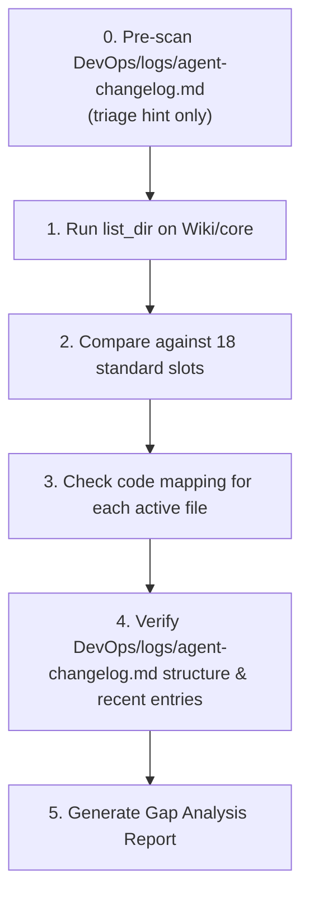

# 🕵️ Documentation Architecture Assessment

This skill defines the active **Auditing and Maintenance Workflow** for managing a project's `Wiki/` (architecture) and `DevOps/` (operational) libraries. It ensures both libraries stay perfectly aligned with the code as features evolve.

---

## 1. The 3-Phase Operational Workflow

Whenever modifying or analyzing a project's codebase or documentation, you **MUST** follow this structured audit process:

### Phase 1: Discovery & Code Audit
Before you write a single word of documentation or code:
1. **Code Inventory:** Run `list_dir` and `grep_search` on the source folders (`src/`, `lib/`, etc.) to inventory active components, hooks, stores, and schemas.
2. **Never Guess:** Never document a component or a workflow based on its name alone. Ground all descriptions in the actual import chains, state shapes, and API payloads present in the codebase.
3. **Verify Context:** Check `Wiki/core/01-vision-north-star.md` and `Wiki/core/02-product-context.md` to ensure your technical understanding aligns with the user personas and strategic objectives.
4. **Pre-Scan the Changelog *(early signal, not a substitute)*:** Read `DevOps/logs/agent-changelog.md` before diving deep. Recent entries can quickly surface which features or components were touched last, flagging areas likely to have stale or missing documentation. Treat this as a **triage hint** — use it to prioritize where to look, but do **not** treat it as a complete picture. The full 3-phase audit below is always required regardless of what the changelog reveals.

### Phase 2: Slot Gap Analysis
Audit the existing `Wiki/` and `DevOps/` directories to evaluate the health of the knowledge infrastructure:
1. **Check standard `Wiki/core` slots:** Match existing filenames in `Wiki/core/` against the **18 canonical slots** defined in the [Documentation Architecture Bootstrap](file:///C:/Users/carso/.gemini/config/skills/documentation-architecture-bootstrap/SKILL.md) standard.
2. **Identify mismatches & gaps:** Highlight missing core files, obsolete naming conventions (e.g., using old index numbering), or orphaned files.
3. **Evaluate detail quality:** Identify files that are hollow placeholders or lack critical requirements (such as missing field-mapping tables in external integrations or missing data shapes in state context).

### Phase 3: Alignment & Dynamic Execution
1. **Ask for Clarification:** If you find duplicate, orphaned, or highly ambiguous files/modules during the audit, **stop** and ask the user for clarifying guidance before proceeding.
2. **Maintain standard linking:** Ensure all spawned or updated documents contain relatives paths linking to category indices and sibling documents (Hub & Spoke model).
3. **Synchronous Upgrades:** If code behavior changes, you **must** update the corresponding documentation files in the same operational cycle.

---

## 2. Syncing & Lifecycle Operations

To maintain database and visual consistency, all documentation updates must adhere to the following execution rules:

### A. Progressive Version Control (YAML)
Every created or modified file must update its YAML frontmatter header:
```yaml
---
type: "feature" | "component" | "database" | "logic" | "core"
name: "Human Readable Name"
status: "stable" | "in-progress" | "deprecated"
dependencies: ["feat-auth", "db-documents"]
db_relations: ["users", "documents"]
description: "Brief summary of the document's purpose."
---
```
Mark superseded documents with `status: "deprecated"` or move them to a `deprecated/` subfolder.

### B. Table of Contents Syncing
When adding or deleting files, you **must** update the corresponding category index:

**Wiki/ (architecture knowledge):**
- `Wiki/features/features-index.md`
- `Wiki/components/components-index.md`
- `Wiki/database/database-index.md`
- `Wiki/logic/logic-index.md`

**DevOps/ (operational tooling):**
- `DevOps/backlog/backlog-index.md`

### C. Project Audit Logging (The Wrap-Up Protocol)
Whenever you finalize a task or complete a feature, you **MUST** record your actions in the project's chronological change record at `DevOps/logs/agent-changelog.md`.
Use this exact markdown block format:

```markdown
## [YYYY-MM-DD HH:MM] - [Task/Feature Name]
**Agent:** Antigravity 
**Files Modified:**
- `src/components/ui/...`
- `docs/features/feat-...`
**Database Changes:** None (or list the SQL migrations applied)
**Summary:** Short summary of changes made, focusing on technical implementation and validation.
```

---

## 3. Standard Audit Protocol Checklist

When asked to "audit", "assess", "check", or "review" a project's documentation, follow these steps:



0. **Pre-scan `DevOps/logs/agent-changelog.md` *(early triage only)*:** Skim the most recent entries to identify recently modified features or components. Use this to **prioritize** which areas to scrutinize first — it is **not** a replacement for the full audit. If no changelog exists, treat that absence itself as a gap finding.
1. **Perform `Wiki/core` Slot Census:** Count active slots, verify filenames follow the correct `0x-name.md` prefix.
2. **Execute Source Verification:** Audit if `Wiki/core/04-directory-structure.md` perfectly matches the actual file tree, and if `Wiki/core/07-state-context.md` matches the types/interfaces in store files.
3. **Trace Integration Payloads:** Audit if `Wiki/core/10-external-integrations.md` has valid field mapping tables connecting internal keys to third-party parameters.
4. **Compile Report:** Report findings clearly to the user, highlighting missing documents, outdated parameters, and proposed remediation steps.
