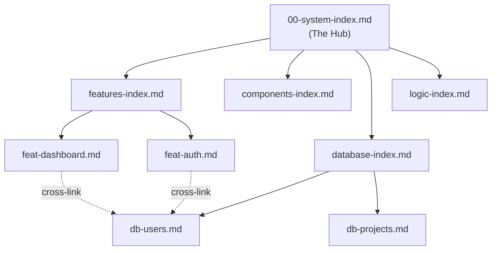

# 🗺️ Documentation Architecture Bootstrap

This skill defines the **Documentation Library Standard**. It is designed to turn a codebase from a "black box" into a transparent, agent-ready intelligence hub — regardless of tech stack, domain, or team size.

> [!IMPORTANT]
> This blueprint is **application-agnostic**. It defines the *pattern*, not the content. Every project that adopts this standard produces two top-level libraries — `Wiki/` (architecture knowledge) and `DevOps/` (operational tooling) — giving both humans and AI agents an instantly predictable navigation structure across any project.

---

## 1. Core Philosophy: "Agent-First Knowledge"

The documentation is not just for humans; it is the **source of truth** for AI Agents.

| Principle | Meaning |
| :--- | :--- |
| **Predictability** | Every piece of logic has a dedicated home. An agent can navigate the library without scanning the entire codebase. |
| **Traceability** | Code and documentation are linked via standardized paths and cross-references. |
| **Context over Code** | Docs explain *why* and *how* something connects, rather than repeating what the code already says. |
| **Separation of Concerns** | Each document owns one topic. No document tries to be everything. |

---

## 2. Folder Taxonomy (The Library Structure)

Every project is organized into **two top-level libraries** and their specialized subdirectories, each with a consistent metaphor to aid recall:

### 📖 Wiki/ — Architecture Knowledge Base

| Directory | Role | Parent/Index File | Description |
| :--- | :--- | :--- | :--- |
| `Wiki/core` | **The Brain** | `00-system-index.md` | Master index, design system, state context, architecture, and all foundational documents. |
| `Wiki/features` | **The Nervous System** | `features-index.md` | Screen-specific documentation, feature workflows, and view-level logic. |
| `Wiki/components` | **The Muscle** | `components-index.md` | Documentation for reusable UI elements — atoms, molecules, and organisms. |
| `Wiki/database` | **The Skeleton** | `database-index.md` | Schema breakdowns, table/collection relationships, and data-layer logic. |
| `Wiki/logic` | **The Internal Organs** | `logic-index.md` | Utility functions, custom hooks, services, parsers, and complex algorithmic explanations. |

### ⚙️ DevOps/ — Operational Process Tooling

| Directory | Role | Parent/Index File | Description |
| :--- | :--- | :--- | :--- |
| `DevOps/logs` | **The Memory** | `agent-changelog.md` | Chronological records of agent actions and audits. |
| `DevOps/backlog` | **The Queue** | `backlog-index.md` | Project backlog index and individual early-prepared backlog plans (`<feature-slug>-backlog.md`). |
| `DevOps/plans` | **The Future** | *(User Managed)* | Historical and active implementation plans. |
| `DevOps/archive-plans` | **The Archive** | `README.md` | Completed and closed implementation plans. |
| `DevOps/prompts` | **The Voice** | *(User Managed)* | Standardized LLM prompts and persona definitions. |

---

## 3. Naming Conventions (The Prefix Pattern)

To ensure high-speed lookup and clarity, files within subdirectories **must** follow specific prefix patterns:

| Directory | Prefix Pattern | Examples |
| :--- | :--- | :--- |
| `Wiki/core/` | `0x-name.md` (numbered sequence) | `00-system-index.md`, `01-vision-north-star.md` |
| `Wiki/features/` | `feat-feature-name.md` | `feat-dashboard.md`, `feat-user-auth.md` |
| `Wiki/components/` | `ui-component-name.md` | `ui-modal-base.md`, `ui-data-table.md` |
| `Wiki/database/` | `db-collection-name.md` | `db-users.md`, `db-projects.md` |
| `Wiki/logic/` | `util-name.md` or `hook-name.md` | `util-date-parser.md`, `hook-use-auth.md` |
| `DevOps/logs/` | `agent-changelog.md` | *(single file, append-only)* |
| `DevOps/backlog/` | `backlog-index.md` or `<feature-slug>-backlog.md` | `backlog-index.md`, `supabase-rls-backlog.md` |
| `DevOps/plans/` | `name-plan.md` | `feat-dashboard-plan.md` |
| `DevOps/archive-plans/` | `name-plan.md` | *(moved from DevOps/plans/ when complete)* |

> [!TIP]
> The numbered `0x-` prefix in `/core` creates a natural **onboarding flow**. New team members (or agents) read documents in sequence to build context progressively.

---

## 4. Standard Document Anatomy

Every `.md` file in the library **should** adhere to this structure:

### A. YAML Frontmatter
```yaml
---
type: "feature" | "component" | "database" | "logic" | "core"
name: "Human Readable Name"
status: "stable" | "in-progress" | "deprecated"
dependencies: ["feat-auth", "db-documents"]
db_relations: ["users", "documents"]
description: "Brief summary of the document's purpose."
---
```

### B. Header & Summary
A clear `# H1` followed by a 2–3 sentence overview of the subject.

### C. Technical Context (The "What")
- **Physical Path:** Explicit path to the code this document describes (e.g., `src/views/Dashboard/`).
- **Data Shape:** JSON, TypeScript, or equivalent definitions of relevant state/models.
- **Visual Diagrams:** Use Mermaid flowcharts or sequence diagrams to visualize logic and data flow.

### D. Relationships (The "How it Connects")
- Links to related database schemas, parent indices, sibling features, or utility dependencies.
- Use relative links within `/docs` for portability.

### E. Rules & Constraints (Optional)
- Any invariants, edge cases, or guard rails specific to this subject.

---

## 5. The "Hub & Spoke" Linking Strategy



- **The Hub:** `Wiki/core/00-system-index.md` acts as the master router. It links to all **Category Index** files in both libraries.
- **The Spokes:** Each category (`Wiki/features/`, `Wiki/database/`, `Wiki/logic/`, `Wiki/components/`) has its own `*-index.md` listing its children.
- **DevOps Cross-Links:** `Wiki/core/00-system-index.md` also links out to `DevOps/backlog/`, `DevOps/plans/`, `DevOps/logs/`, and `DevOps/archive-plans/`.
- **Cross-Links:** Individual documents link directly to their related schemas, utilities, or dependencies using relative paths.

---

## 6. Foundation Documents Checklist

Use this checklist to establish the core knowledge infrastructure. Every document listed below is a canonical slot in a production-ready, agent-navigable repository.

### 🧠 Wiki Core Brain Documents (`Wiki/core/`)

All 19 slots are defined below in their canonical numbered order.

---

#### `00-system-index.md` — The Hub
- **Purpose:** The master entry point for the entire documentation library.
- **Contains:** Product principles, high-level architecture diagram (Mermaid), links to every category index, and a **brief directory overview of all active core docs**.
- **✅ Must Do:** Include a Mermaid diagram showing the data flow from UI → Logic → Data Layer. Include a **comprehensive summary table or brief overview mapping the 18 core documents (`01` to `18`)** to serve as a fast structural index for developers and agents.
- **❌ Don't:** Include specific code snippets or API endpoint details.

---

#### `01-vision-north-star.md` — The Goal
- **Purpose:** Captures the high-level strategic vision and competitive positioning of the product.
- **Contains:** The vision statement, north star metric, problem/solution framing, competitive positioning, the product's "Magic Moment".
- **✅ Must Do:** Clearly define the single "Magic Moment" — the instant a user realizes the product's value.
- **❌ Don't:** Include tactical implementation details; keep this purely strategic.

---

#### `02-product-context.md` — The Strategy
- **Purpose:** Bridges the gap between code and the business domain it serves.
- **Contains:** User personas, domain workflow descriptions, core use cases, product roadmap, link to the Glossary.
- **✅ Must Do:** Maintain high-level personas and link to the Glossary for detailed terminology.
- **❌ Don't:** Include any technical implementation details.

---

#### `03-user-journey.md` — The Workflow
- **Purpose:** Describes the application from the user's perspective, not the developer's.
- **Contains:** Onboarding path, primary "Happy Path" flow (numbered steps), secondary flows, error recovery / edge-case handling.
- **✅ Must Do:** Use numbered steps to describe the core workflow from the user's point of view.
- **❌ Don't:** Use technical jargon; describe it in terms the user would understand.

---

#### `04-directory-structure.md` — The Map
- **Purpose:** Prevents file sprawl by defining where every type of file belongs.
- **Contains:** Root overview, source tree layout, logic directory, component library structure.
- **✅ Must Do:** Map directory paths to their functional purpose (e.g., "`src/utils/` — pure business logic, no UI imports").
- **❌ Don't:** List every individual file; focus on the folder hierarchy and naming rules.

---

#### `05-app-structure.md` — The Shell
- **Purpose:** Documents the application's outermost structural layer.
- **Contains:** Main entry point, router configuration, global layout wrappers (and their props), navigation/sidebar/header architecture.
- **✅ Must Do:** Detail the root component tree and how layout wrappers constrain child content.
- **❌ Don't:** Document individual page logic; that belongs in `features/`.

---

#### `06-design-system.md` — UI/UX Standards
- **Purpose:** The single source of truth for visual design decisions.
- **Contains:** Color tokens (HSL/semantic), typography scale, spacing/layout patterns, form element styles, interactive states (hover, focus, disabled).
- **✅ Must Do:** List exact class names or token values used in the project's styling system.
- **❌ Don't:** Use generic color names ("blue", "red"); always use project-specific tokens.

---

#### `07-state-context.md` — Data Shapes & State Management
- **Purpose:** Maps how data lives in memory and flows between components.
- **Contains:** Provider/store tree, global state schemas (JSON/TS), context/hook APIs, persistence strategy (local storage, session, DB sync).
- **✅ Must Do:** Provide exact example shapes for complex objects (e.g., nested arrays, mapped records).
- **❌ Don't:** Document local component state; focus only on shared/global state.

---

#### `08-core-architecture.md` — The Logic Flow
- **Purpose:** Documents the "why" behind critical technical decisions.
- **Contains:** Data lifecycle, core engines/algorithms, calculated fields, derivation logic, technical guard rails (e.g., soft-deletes, optimistic updates, idempotency).
- **✅ Must Do:** Explain the reasoning behind architectural choices, not just what the code does.
- **❌ Don't:** Repeat information found in the Design System or Database docs.

---

#### `09-ai-features.md` — AI Features & Pipelines
- **Purpose:** Documents the end-user facing AI capabilities and prompt/model architectures of the application.
- **Contains:** In-app AI feature flows, LLM/model integration architecture, system prompts, prompt/response serialization schemas, fallback rules.
- **✅ Must Do:** Outline standard template patterns for dynamic prompts and response validations.
- **❌ Don't:** Document developer instructions for using AI tools to build the app (that belongs in root developer guides like `GEMINI.md`).

---

#### `10-external-integrations.md` — Third-Party & API Connections
- **Purpose:** Documents all data exchange points between the application and external systems.
- **Contains:** Integration endpoints, data mapping/transformation tables, authentication flows, export/import column mappings, grouping/deduplication logic.
- **✅ Must Do:** Provide explicit field-mapping tables showing internal field → external field for every integration.
- **❌ Don't:** Embed API secrets or credentials; reference environment variable names only.

---

#### `11-validation-standards.md` — Data Integrity & Error Handling
- **Purpose:** Defines the validation engine that ensures data quality across the application.
- **Contains:** Validation tiers (field-level, entity-level, cross-entity), error classification (warning vs. critical stop), error dashboard/aggregation patterns, guided resolution UX patterns.
- **✅ Must Do:** Define which validation failures block user progression (e.g., finalization, submission, export).
- **❌ Don't:** Document individual field validators inline; describe the *system* and its tiers.

---

#### `12-utility-standards.md` — Calculation & Formatting Conventions
- **Purpose:** Enforces consistency in precision, formatting, and visual micro-patterns across the codebase.
- **Contains:** Rounding rules (financial, aggregation), number/date/currency formatters, ID generation strategies, reusable visual styling micro-patterns (e.g., metallic edges, tinted shadows, glassmorphism configs).
- **✅ Must Do:** Document the exact formatter calls and precision requirements for all numeric outputs.
- **❌ Don't:** Duplicate full design system tokens; reference `06-design-system.md` for color/spacing and keep this doc focused on logic-level conventions.

---

#### `13-security-standards.md` — Security Standards
- **Purpose:** Establishes the project's Core Security Perimeter and Agentic Governance standard.
- **Contains:** Strict security boundaries, zero-trust database principles, secret and environment variable management, RLS schemas, dependency pinning, and API abuse/rate limiting controls.
- **✅ Must Do:** Document exact policies for RLS, environment variable configuration, and dependency audits.
- **❌ Don't:** Expose raw credentials or secrets; keep instructions high-level and focused on security structure.

---

#### `14-performance-standards.md` — The Guardrails
- **Purpose:** Technical rules for maintaining application performance and bundle health.
- **Contains:** Bundle/build architecture, framework-specific configuration, code patterns (lazy-loading, memoization), dependency approval protocol, performance budgets.
- **✅ Must Do:** Document lazy-loading requirements and performance budgets for all new features.
- **❌ Don't:** Approve new heavy dependencies without a dynamic import or tree-shaking strategy.

---

#### `15-theme-linguistics.md` — Theming & Content Localization
- **Purpose:** Documents how the UI adapts its terminology, labels, and nomenclature across themes, locales, or white-label configurations.
- **Contains:** Nomenclature mapping tables (functional area → display label per theme/locale), translation key registry, rules for avoiding hardcoded strings.
- **✅ Must Do:** Provide a mapping table showing every functional area's label under each theme/variant.
- **❌ Don't:** Hardcode UI text strings in code documentation; always reference translation keys.

---

#### `16-glossary-of-terms.md` — The Lexicon
- **Purpose:** Eliminates ambiguity by defining every domain-specific term used in the project.
- **Contains:** Application logic terms, design token names, industry/domain terminology, abbreviations.
- **✅ Must Do:** Keep definitions concise; cross-reference with database fields where applicable.
- **❌ Don't:** Use conflicting definitions across documents — this is the canonical source.

---

#### `17-docs-blueprint.md` — The Standard (This Skill, In-Repo)
- **Purpose:** A lightweight, in-repo reference to this Documentation Architecture Bootstrap standard.
- **Contains:** Core philosophy summary, folder taxonomy, naming conventions, link to the full skill for the complete checklist.
- **✅ Must Do:** Keep this as a concise pointer to the global skill, not a full duplication.
- **❌ Don't:** Deviate from the `0x-name.md` numbering system in `/core`.

---

#### `18-knowledge-capture.md` — The Decision Log
- **Purpose:** A living record of architectural decisions, user feedback, and tribal knowledge.
- **Contains:** Decision log entries with date, context, rationale, and impact assessment.
- **✅ Must Do:** Update whenever a key architectural or product decision is made.
- **❌ Don't:** Let this fall behind; it is the secondary source of truth for stakeholder preferences.

---

### 📂 Subfolder Parent Indices

Each subfolder index serves as a **table of contents** for its category. It groups children by business module or functional area and links to both the individual doc and the source code path.

#### `features-index.md`
- **✅ Must Do:** Group features by business module; link to the physical source path.
- **❌ Don't:** Put implementation details here; link to the specific `feat-*.md` file.

#### `components-index.md`
- **✅ Must Do:** List every reusable component with its physical path.
- **❌ Don't:** Document props here; do that in the specific `ui-*.md` file.

#### `database-index.md`
- **✅ Must Do:** Include a "When to Read Which Doc" table mapping common tasks to schema files.
- **❌ Don't:** Include raw DDL; use descriptions and link to the `db-*.md` files.

#### `logic-index.md`
- **✅ Must Do:** Summarize the responsibility of each utility/hook (input → output).
- **❌ Don't:** Copy-paste function source code; explain the contract.

#### `DevOps/logs/agent-changelog.md`
- **✅ Must Do:** Follow the strict format defined in the project's agent entry point (`AGENT.md` or equivalent).
- **❌ Don't:** Write long paragraphs; use concise bullet points with timestamps.

#### `DevOps/logs/version-history.md`
- **✅ Must Do:** Document all major, minor, and patch version increments with dates, deployer names, and core highlights following the 3-Level Versioning Strategy.
- **❌ Don't:** Include minor developer detail in release highlights; keep them high-level and readable for stakeholders.

#### `DevOps/backlog/backlog-index.md`
- **✅ Must Do:** Keep a high-level list of all parked, deferred, and future roadmap items, with direct links to their detailed `<feature-slug>-backlog.md` plan files.
- **❌ Don't:** Place detailed technical plans or specifications directly in the index; keep them isolated in separate backlog plan files.

---

### 🛠️ User-Managed Directories

The following directories are **User Managed**. Agents should **never** create or update index files for these folders unless explicitly asked:

- **`DevOps/plans/`** — Active and historical implementation plans.
- **`DevOps/archive-plans/`** — Completed and closed plans (moved from `DevOps/plans/` on completion).
- **`DevOps/prompts/`** — Standardized LLM prompts and persona definitions.

---

## 7. Bootstrapping a New Project

When applying this blueprint to a **new** project for the first time:

> [!TIP]
> **Don't start from scratch.** This skill includes a `references/` directory containing **19 pre-built, application-agnostic Markdown templates** — one for every canonical `/docs/core` slot (`00` through `18`). Always use these as your starting scaffold. They contain the correct frontmatter, section headings, structural patterns, and inline `[PLACEHOLDER]` prompts that guide you through filling in project-specific content.

1. **Read the templates first:** Run `list_dir` on this skill's `references/` directory to see all available scaffolds. Copy the relevant template into the target project's `Wiki/core/` directory before writing any content.
2. **Create the folder structure** per Section 2 — both `Wiki/` and `DevOps/` top-level directories.
3. **Seed `Wiki/core/00-system-index.md`** with the project name, a placeholder architecture diagram, links to empty category indices (Wiki spokes) and DevOps operational links, and the **summary table listing all core docs (`01` to `18`)**.
4. **Create empty category indices** (`Wiki/features/features-index.md`, `Wiki/components/components-index.md`, `Wiki/database/database-index.md`, `Wiki/logic/logic-index.md`, `DevOps/backlog/backlog-index.md`).
5. **Run a Gap Analysis** against the Foundation Checklist (Section 6) and prioritize:
   - `Wiki/core/01-vision-north-star.md` (establishes the product's goal and magic moment)
   - `Wiki/core/04-directory-structure.md` (prevents file sprawl and maps code locations)
   - `Wiki/core/06-design-system.md` (prevents UI inconsistency and sets visual standards)
6. **Fill remaining docs** incrementally as features are built.

---

> [!IMPORTANT]
> **The Golden Rule:** If a feature's behavior changes in code, the documentation **MUST** be updated in the same PR/Conversation. Outdated documentation is technical debt.
