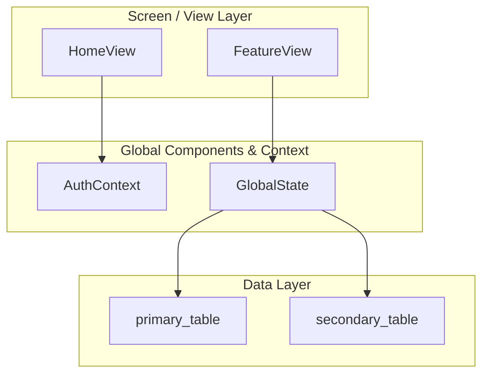

# System Index — [APP_NAME] Developer Onboarding Hub

This document is the master gateway into the documentation library. Start here to understand product philosophy, structural patterns, and data infrastructure.

---

## 1. Product & Principles
- [Vision & North Star](./01-vision-north-star.md)
- [Product Context & Strategy](./02-product-context.md)
- [Glossary of Terms](./16-glossary-of-terms.md)
- [UI/UX Design System](./06-design-system.md)
- [Knowledge Capture & Decisions](./18-knowledge-capture.md)
- [Agent Changelog](../../DevOps/logs/agent-changelog.md)

## 2. Core Architecture & Logic
- [User Journey & Data Hierarchy](./03-user-journey.md)
- [Physical Directory Structure](./04-directory-structure.md)
- [App Shell Structure](./05-app-structure.md)
- [Core Architecture Concepts](./08-core-architecture.md)
- [State & Context Data Shapes](./07-state-context.md)
- [AI Features & Workflows](./09-ai-features.md)
- [External Integrations](./10-external-integrations.md)
- [Validation Standards](./11-validation-standards.md)
- [Utility Standards](./12-utility-standards.md)
- [Security Standards](./13-security-standards.md)
- [Performance Standards](./14-performance-standards.md)
- [Theme & Linguistics](./15-theme-linguistics.md)

## 3. Component & View Code

**Codebase Navigation**
- [Physical Directory Structure](./04-directory-structure.md)

**Component Systems** → [Components Index](../components/components-index.md)
<!-- List key reusable UI components here -->

**Views & Routing** → [Features Index](../features/features-index.md)
<!-- List primary screens/routes here -->

## 4. Visual Architecture Flow

Add a Mermaid diagram here showing how UI routes map to data layer tables/APIs:

## 5. Core Logic & Utilities
→ [Logic & Utilities Index](../logic/logic-index.md)

**Utility Functions**
<!-- List key utility files here, e.g.: -->
<!-- - [CSV Parser](../logic/util-csv-parser.md) — `src/utils/csvParser.js` -->

**Custom Hooks**
<!-- List key hooks here, e.g.: -->
<!-- - [useDataFetch](../logic/hook-data-fetch.md) — `src/hooks/useDataFetch.js` -->

## 6. Database Schema Signatures
<!-- List each data table/collection doc here, e.g.: -->
<!-- - [Users Schema](../database/db-users.md) -->
<!-- - [Projects Schema](../database/db-projects.md) -->

## 7. Strategic & Operational Docs
- [Backlog Index](../../DevOps/backlog/backlog-index.md)
- [Active Plans](../../DevOps/plans/)
- [Documentation Architecture Blueprint](./17-docs-blueprint.md)
