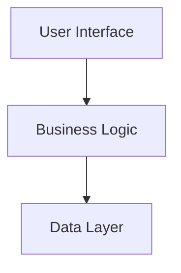

# 🗺️ System Index

Welcome to the documentation library. This is the master entry point and directory overview.

## 📐 Architecture Flow

## 📂 Category Indexes

### 📖 Wiki (Architecture)
- [Features](../features/features-index.md)
- [Components](../components/components-index.md)
- [Database](../database/database-index.md)
- [Logic](../logic/logic-index.md)

### ⚙️ DevOps (Operational)
- [Plans](../../DevOps/plans/template-plan.md)
- [Backlog](../../DevOps/backlog/backlog-index.md)
- [Archive](../../DevOps/archive-plans/README.md)
- [Version History](../../DevOps/logs/version-history.md)
- [Agent Changelog](../../DevOps/logs/agent-changelog.md)

## 🧠 Core Brain Documents

| File | Purpose |
| :--- | :--- |
| [00-system-index.md](00-system-index.md) | Master router and architecture flow. |
| [01-vision-north-star.md](01-vision-north-star.md) | Strategic vision, value proposition, and magic moment. |
| [02-product-context.md](02-product-context.md) | User personas, domain workflows, and product roadmap. |
| [03-user-journey.md](03-user-journey.md) | The application from the user's perspective (happy path). |
| [04-directory-structure.md](04-directory-structure.md) | Physical folder structure map and location rules. |
| [05-app-structure.md](05-app-structure.md) | Application shell, layouts, and global wrapper configs. |
| [06-design-system.md](06-design-system.md) | Color palettes, typography scale, and styling standards. |
| [07-state-context.md](07-state-context.md) | Shared stores, global context, and local state rules. |
| [08-core-architecture.md](08-core-architecture.md) | Critical architectural decisions, calculations, and guardrails. |
| [09-ai-features.md](09-ai-features.md) | In-app AI pipelines, prompt structure, and models. |
| [10-external-integrations.md](10-external-integrations.md) | Third-party systems, data sync rules, and field mapping. |
| [11-validation-standards.md](11-validation-standards.md) | Data validation, tiers (field/entity/cross), error hierarchy. |
| [12-utility-standards.md](12-utility-standards.md) | Formatter definitions, precision rules, and micro-patterns. |
| [13-theme-linguistics.md](13-theme-linguistics.md) | Localization keys, white-label configurations, and nomenclature. |
| [14-performance-standards.md](14-performance-standards.md) | Performance budget, memoization, lazy loading, and build setup. |
| [15-security.md](15-security.md) | RLS policies, secrets management, and agent governance. |
| [16-glossary-of-terms.md](16-glossary-of-terms.md) | Canonical dictionary of project terms and domain jargon. |
| [17-docs-blueprint.md](17-docs-blueprint.md) | References the global Documentation Architecture standard. |
| [18-knowledge-capture.md](18-knowledge-capture.md) | Decision logs, rationale, and stakeholder preferences. |
